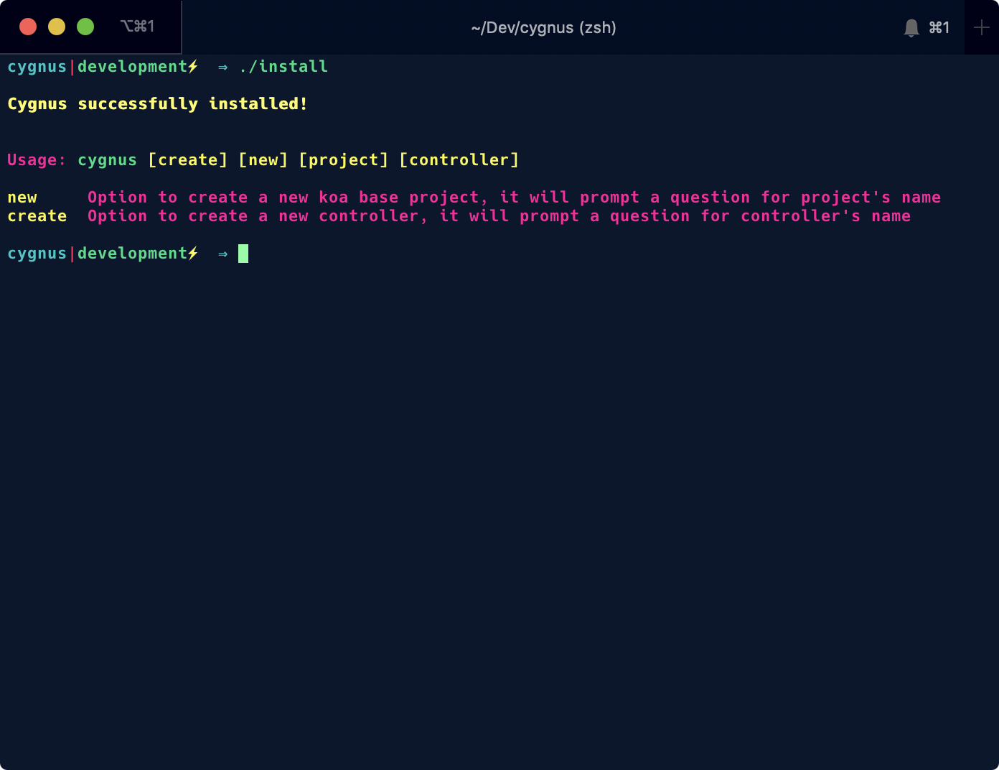
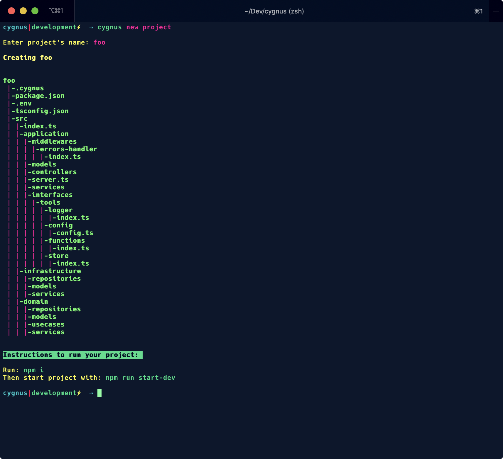

# Cygnus

Cygnus is a KoaJS cli project that helps to create projects faster and easier based on Domain Driven Development and built with TypeScript.

## Install

To install cygnus simply run:

```  bash
./install
```



## Getting started

With cygnus you can create projects and files for your projects with a few commands so you can avoid start your project from scratch file by file.

### Create a project

To create a project run:

``` bash
cygnus new project
```

then cygnus will promp a message to give a name to your project, here's an example:



## Uninstall

To uninstall Cygnus from your system simply run:

```  bash
./uninstall
```

## Authors

* **LvcasX1** - [LvcasX1](https://github.com/LvcasX1)
